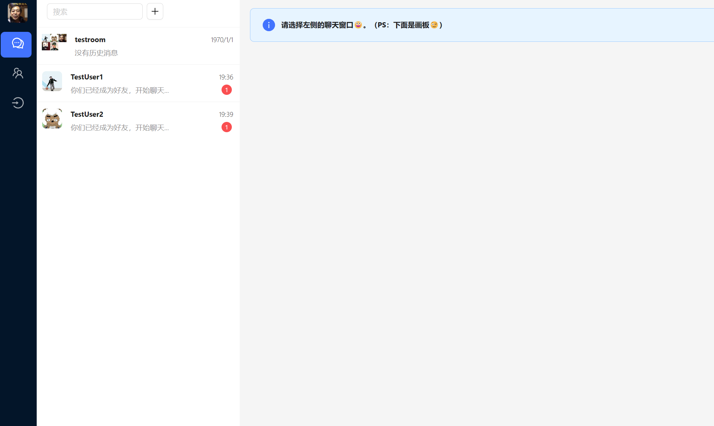

# 用户手册

## 登录与注册

登录与注册界面如下

RISCV-V使用邮箱验证码注册，支持密码登录与邮箱验证登录两种方式。

1. 邮箱注册：登录注册界面-注册-进行注册
2. 密码登录：登录注册界面-用户名登录-输入用户名与密码
3. 邮箱登录：登录注册界面-邮箱登录-输入邮箱及验证码

*使用清华邮箱获取验证码较慢，建议使用网易邮箱、gmail、QQ邮箱等

## 用户管理

### 用户信息管理

点击用户头像，可以看到用户信息管理界面如下：

在左侧显示了用户的基本信息，下方是用户信息修改界面，包括上传头像、修改用户名、修改邮箱绑定、修改密码等功能。在页面的上方可以注销用户。

### 用户登出

点击左侧的登出键即可完成登出

## 好友管理

好友管理页面如下：

左侧显示了好友列表，右侧显示了好友分组。

通过左上角的’+’可以根据姓名查看其他用户可以公开的基本信息，并发送添加好友申请

在“查看好友申请”一项中可以查看好友的申请并同意或拒绝。

添加好友后，好友出现在左侧好友列表中，同时可以在好友列表中删除好友。

在页面的右侧可以添加好友分组，添加好友分组需要输入分组名称、添加的好友，添加分组后，会在右侧显示已经添加的分组：

## 群聊

群聊的页面如下，左侧是该用户所在群聊的列表，右侧是某一群聊的聊天窗口：

### 创建群聊

群聊界面-左上角‘+’-选择添加的群聊用户-创建群聊

或者在私聊中点击右侧群聊信息，添加新成员即可，示例如下：

### 群聊信息

点击群聊界面右侧的消息栏，可以查看群聊的信息，包括群成员、群公告、备注、昵称等，同时可以进行对于群聊的操作

### 群聊管理

右键点击群成员头像，可以对成员进行操作

转让群主：群聊信息-右键群成员头像-转让群主（或在群管理中设置）

设置管理员：群聊信息-右键群成员头像-设置管理员（或在群管理中设置）

移除群成员：群聊信息-右键群成员头像-踢出群聊（或在群管理中设置）

群公告：群聊信息-群公告

撤销消息：与“在线会话”中一致，右键点击消息并撤销

### 成员管理

成员邀请：群聊信息-成员列表中添加

退出群聊：群聊信息-退出群聊

## 在线会话

在群聊界面的输入框中输入文字即可发送消息，不同用户的聊天框被具有不同的颜色，在对话过程中显示消息发送时间，与微信相似

将光标置于消息附近的圆圈可以显示消息已读相关信息

在线会话支持对图片、语音、文件、表情的发送，在聊天框上侧可以选择发送的类型，下面展示发送emoji表情和图片的示例

点击聊天框上侧最右侧的图标可以查看聊天记录并进行筛选，聊天记录的删除在拓展功能列表中。

右键单击一条消息可以弹出拓展功能列表，支持进行翻译、撤回（仅限自己的消息）、引用（对应需求文档中的回复）、删除、转发等操作，支持一般转发、多媒体转发与嵌套转发。

在群聊信息一栏中可以进行消息免打扰、置顶聊天的设置。

## 语音通话与视频通话

点击聊天框上方视频/语音通话一项，语音通话界面如下：

在下方选择进行语音通话的好友，再点击发送语音通话请求，进行语音通话，点击“结束语音通话”以结束语音通话。

可以切换至视频通话模式

左右两侧的窗口分别显示视频通话的双方，使用者需在下方选择进行视频通话的好友，并发送视频通话的请求，当需要结束视频通话时可以点击”结束视频通话“