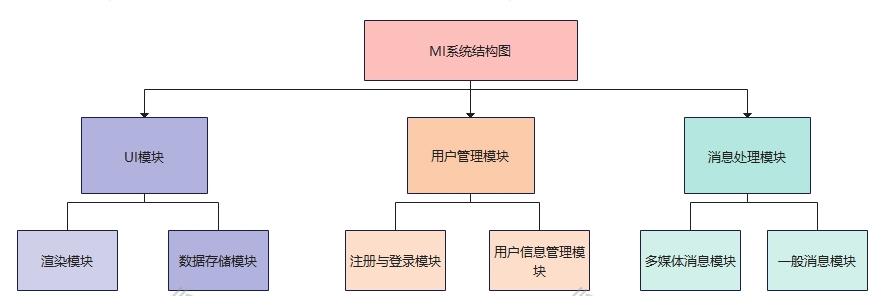

## 模块设计

### 模块概览

本项目设计中，包含以下三个模块：

1. UI模块：位于前端，负责页面的显示和与后端通信的功能
2. 用户管理模块：位于后端，负责用户信息的维护，包括注册用户、用户登录、用户登出、用户信息修改等功能。
3. 消息处理模块：位于后端，处理聊天消息、群聊管理、添加好友、删除好友等操作。

### 模块设计细节

#### UI模块

UI模块可以分为渲染模块与数据存储模块

1. 渲染模块：负责渲染交互界面，包含前端的各种组件。
2. 数据存储模块：存储与聊天、个人信息维护相关的信息，并与后端进行数据交互。

#### 用户管理模块

用户管理模块从功能上可以解耦为处理注册与登录的部分与处理用户信息的部分，该模块基于http协议

1. 注册与登录：支持用户的登录与注册
2. 用户信息管理：支持查看用户信息、修改用户名、修改邮箱、修改密码、修改头像等操作

#### 消息处理模块

消息处理模块从实现协议上可以区分为基于http协议的多媒体消息模块与基于websocket协议的一般消息模块

1. 多媒体消息模块：支持发送图片、表情、语音、文件等内容。
2. 一般消息模块：在统一的consumer模块中实现，依照websocket及规定的相关协议支持消息发送和与群聊相关的操作

### 系统结构图示

## 数据库模型

### 用户模型User

| 字段             | 类型            | 属性         | 说明                 |
| ---------------- | --------------- | ------------ | -------------------- |
| id               | BigAutoField    | 主键         | 用户id               |
| name             | CharField       |              | 用户姓名             |
| password         | CharField       |              | 用户密码             |
| created_time     | FloatField      |              | 创建时间             |
| email            | EmailField      | unique=true  | 邮箱                 |
| image            | ImageField      | 存在默认头像 | 头像                 |
| contacts         | ManyToManyField |              | 联系人               |
| self_room_id     | IntegerField    | default=-1   | 用户自己所在的群聊id |
| top_rooms        | TextField       |              | 置顶群聊             |
| no_disturb_rooms | TextField       |              | 免打扰群聊           |
| friends_group    | CharField       |              | 好友分组             |
| invitations      | CharField       |              | 待处理申请           |

### 消息模型Message

| 字段             | 类型            | 属性 | 说明             |
| ---------------- | --------------- | ---- | ---------------- |
| id               | BigAutoField    | 主键 | 用户id           |
| mtype            | CharField       |      | 消息类型         |
| room_id          | BigIntegerField |      | 所属群聊id       |
| index            | IntegerField    |      | 消息时房间第几条 |
| sender_id        | BigIntegerField |      | 发送者id         |
| receiver_id      | BigIntegerField |      | 接收者id         |
| create_time      | FloatField      |      | 创建时间         |
| content          | TextField       |      | 内容             |
| read             | BooleanField    |      | 是否已读         |
| recalled         | BooleanField    |      | 是否撤回         |
| msg_op           | IntegerField    |      | 消息操作号       |
| at_ids           | TextField       |      | @的人的id列表    |
| qoute_message_id | BigIntegerField |      | 引用消息的id     |

### 群聊模型Room

| 字段         | 类型            | 属性 | 说明       |
| ------------ | --------------- | ---- | ---------- |
| id           | BigAutoField    | 主键 | 用户id     |
| name         | CharField       |      | 群聊名称   |
| create_time  | FloatField      |      | 创建时间   |
| rtype        | CharField       |      | 群聊类型   |
| image        | ImageField      |      | 群聊头像   |
| room_length  | BigIntegerField |      | 消息条数   |
| owner_id     | BigIntegerField |      | 群主id     |
| admin_ids    | TextField       |      | 成员id列表 |
| announcement | TextField       |      | 群公告     |
| members      | ManyToManyField |      | 群成员     |

### 文件模型File

| 字段    | 类型            | 属性 | 说明     |
| ------- | --------------- | ---- | -------- |
| id      | BigAutoField    | 主键 | 文件id   |
| file    | FileField       |      | 文件     |
| room_id | BigIntegerField |      | 所属群id |

### 图片模型Image

| 字段    | 类型            | 属性 | 说明     |
| ------- | --------------- | ---- | -------- |
| id      | BigAutoField    | 主键 | 图片id   |
| image   | ImageField      |      | 图片     |
| room_id | BigIntegerField |      | 所属群id |

### 语音模型Voice

| 字段    | 类型            | 属性 | 说明     |
| ------- | --------------- | ---- | -------- |
| id      | BigAutoField    | 主键 | 语音id   |
| voice   | FileField       |      | 语音     |
| room_id | BigIntegerField |      | 所属群id |

### 表情模型Expression

| 字段       | 类型            | 属性 | 说明     |
| ---------- | --------------- | ---- | -------- |
| id         | BigAutoField    | 主键 | 表情id   |
| expression | ImageField      |      | 表情     |
| room_id    | BigIntegerField |      | 所属群id |

